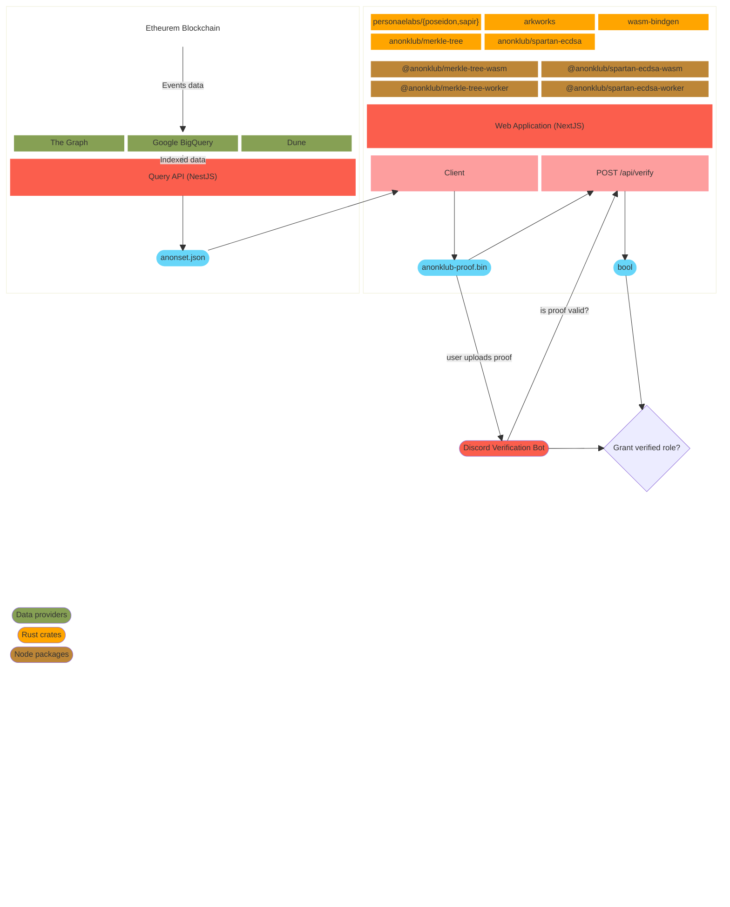

# Architecture

```mermaid
block-beta
columns 1
  block:queryclientgroup
    columns 2
    block:queryapi
      columns 1
      ebd["Etheurem Blockchain"]
      space:2
      block:dataproviders
        columns 3
        tg["The Graph"] gbq["Google BigQuery"] d["Dune"]
      end
      q["Query API (NestJS)"]
      space
      anonset(["anonset.json"])
    end
  
    block:client
      columns 1
      block:clientgroup1
        columns 3
         c_personaelabs["personaelabs/{poseidon,sapir}"] c_arkworks["arkworks"] c_wasm["wasm-bindgen"]
         c_merkle ["anonklub/merkle-tree"] c_spartan["anonklub/spartan-ecdsa"]
      end
      block:clientgroup2
        columns 2
        n_merkle["@anonklub/merkle-tree-wasm"] n_spartan["@anonklub/spartan-ecdsa-wasm"]
        n_merkle_worker["@anonklub/merkle-tree-worker"] n_spartan_worker["@anonklub/spartan-ecdsa-worker"]
      end
      nextapp["Web Application (NextJS)"]
      block:clientgroup3
        Client
        verify_api["POST /api/verify"]
      end
      space
      block:clientgroup4
        proof_bin(["anonklub-proof.bin"])
        valid(["bool"])
      end
    end
  end

block:dbgroup
  columns 6
  space:3 db(["Discord Verification Bot"]) verification{"Grant verified role?"}
end

block:legend
  columns 9
  block:legendgroup
    columns 1
    dp(["Data providers"]) crates(["Rust crates"]) np(["Node packages"])
  end
end

ebd --"Events data"--> dataproviders
dataproviders --"Indexed data"--> q
q --> anonset
anonset --> Client
  
Client --> proof_bin
proof_bin -- "user uploads proof" --> db
proof_bin --> verify_api
verify_api --> valid
  
db --"is proof valid?" --> verify_api

valid --> verification
db --> verification
  
style dataproviders fill: white, stroke: white
style tg fill:#86a054,stroke:#85a054,color:white
style gbq fill:#86a054,stroke:#85a054,color:white
style d fill:#86a054,stroke:#85a054,color:white

style c_personaelabs fill:orange,stroke:orange,color:white
style c_arkworks fill:orange,stroke:orange,color:white
style c_wasm fill:orange,stroke:orange,color:white
style c_merkle fill:orange,stroke:orange,color:white
style c_spartan fill:orange,stroke:orange,color:white

style n_merkle fill:#bd8637,stroke:#bd8637,color:white
style n_spartan fill:#bd8637,stroke:#bd8637,color:white
style n_merkle_worker fill:#bd8637,stroke:#bd8637,color:white
style n_spartan_worker fill:#bd8637,stroke:#bd8637,color:white

style queryapi fill: white
style client fill: white
style clientgroup1 fill: white, stroke: white
style clientgroup2 fill: white, stroke: white
style clientgroup3 fill: white, stroke: white
style clientgroup4 fill: white, stroke: white
style Client fill:#fd9e9e,stroke:#fd929e,color:white
style verify_api fill:#fd9e9e,stroke:#fd929e,color:white
style queryclientgroup fill:white,stroke:white
style dbgroup fill:white,stroke:white
style legend fill:white,stroke:white
style legendgroup fill:white,stroke:white

style dp fill: #86a054,stroke #86a054, color:white
style crates fill: orange,stroke orange, color:white
style np fill: #bd8637,stroke #bd8637, color:white

style q fill:#FB5E4D,stroke:#FB5E4D,color:white
style nextapp fill:#FB5E4D,stroke:#FB5E4D,color:white
style db fill:#FB5E4D,stroke:#FB5E4,color:white
style anonset fill:#67D6F9,stroke:#67D6F9,color:white
style proof_bin fill:#67D6F9,stroke:#67D6F9,color:white
style valid fill:#67D6F9,stroke:#67D6F9,color:white
 
style ebd fill:white, stroke:white, color:#f9f9f9
```
